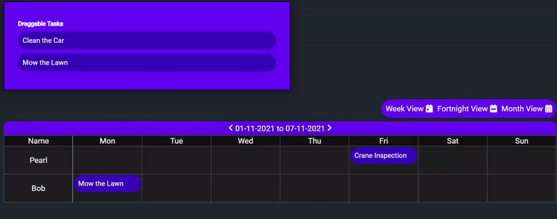

# EasyScheduler

EasyScheduler is a simple task scheduling tool built in Vanilla JS, with a PHP and MySQL backend. 
## Features

Supports a simple drag drop functionality to assign tasks to users. Dynamic MySQL backend allows for easy application for backend developers. Support for holidays as shown in the Example, 3 views (week, fortnight and month) supported with custom timeframes being easy to implement. 
## Getting Started
The scheduler can be initialised by constructing a container with a child class 'Scheduler' and an ID of 'scheduler'. EasyScheduler will handle the rest!
```html
<div class="container">
    <div id="scheduler" class="Scheduler">
    </div>
</div>
```
Getting started using the drag and drop functionality is simple and follows a similar method!
```html
<div id="itembox" class="itembox"></div>
```
See the example in index.html for more examples of use-cases and functionality. Make sure to include Moment.JS and relevant JS scripts in your HTML file.
## Contributions
Pull requests are welcome. For major changes, please open an issue first to discuss what you would like to change.
### Upcoming Features

* Hover-over mouse events to provide greater description of tasks on the grid.
* Support for UK/US bank holidays to be automatically populated
* Multi-day/timeframe events
* Simpler support for different date formats

## License
This code is free for modification for non-profit purposes. Commercial use and modification of this project and its source code must be approved my milpan first.