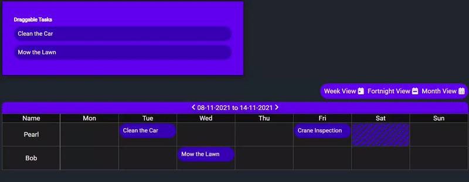

# EasyScheduler



Simple task scheduler built using Vanilla Javascript and HTML to assign tasks to certain users. Supports drag drop functionality of tasks onto the grid. 
## Features to Implement
Month View and 7 Day View allowing users to easily select month and year instead of scrolling through the calendar.
Support for Holidays, greying out cells.
Hover-over events to allow for the deletion and edit of tasks.
## How to Use
index.html shows a working demo of the scheduler, it can be set up by constructing a container with an element of class 'Scheduler' and an id of 'scheduler'. Javascript will do the rest!
```
<div class="container">
    <div id="scheduler" class="Scheduler">
    </div>
</div>
```
Of course remember to include both Moment.JS and the relevant JavaScript files as in the working example in index.html 
## License
This code is free for modification for non-profit purposes. Commercial use and modification of this project and its source code to be approved by myself first.
